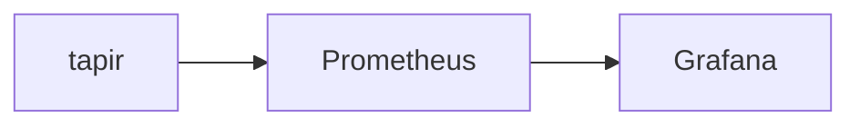

# Observability

Idea is to have a local Grafana instance that visualizes OpenTelemetry metrics from the Test Runs generated by the `tapir` tool. Like that we can visualize the results of the tests in Grafana and setup alerts based on the results.

## Big Picture

## Services

| Service       | URL                   |
| ------------- | --------------------- |
| Grafana       | http://localhost:3000 |
| Prometheus    | http://localhost:9090 |

Grafana Default credentials:
- User: admin
- Password: grafana

## Resources

- [OpenTelemetry .NET](https://opentelemetry.io/docs/languages/dotnet/getting-started/)
- [Use OpenTelemetry with Prometheus, Grafana, and Jaeger](https://learn.microsoft.com/en-us/dotnet/core/diagnostics/observability-prgrja-example)

## Notes

- topk(1, tapir_test_case) by (instance, job, domain, test_case_id, status, error_message, duration, timestamp)
